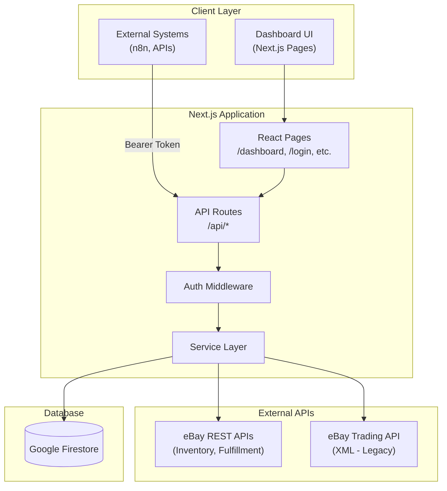
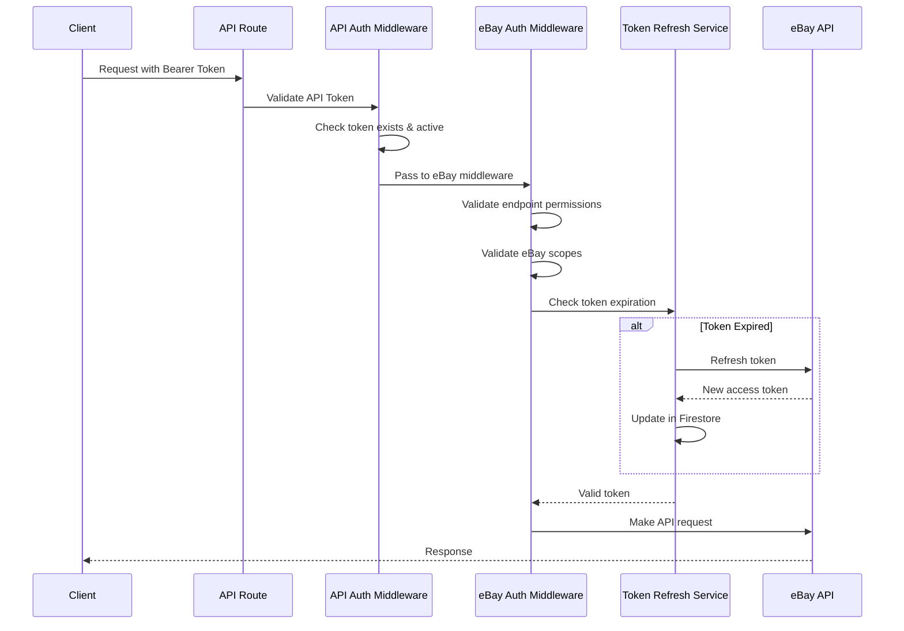
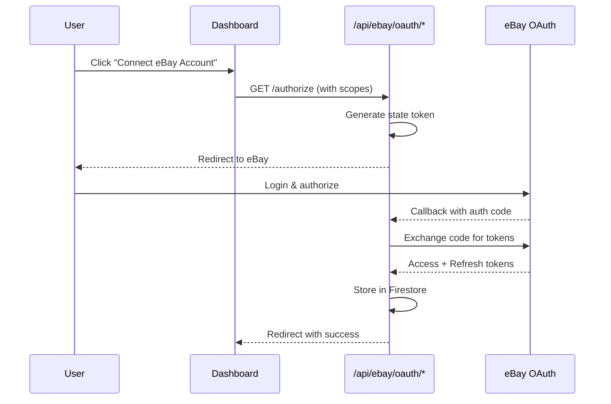
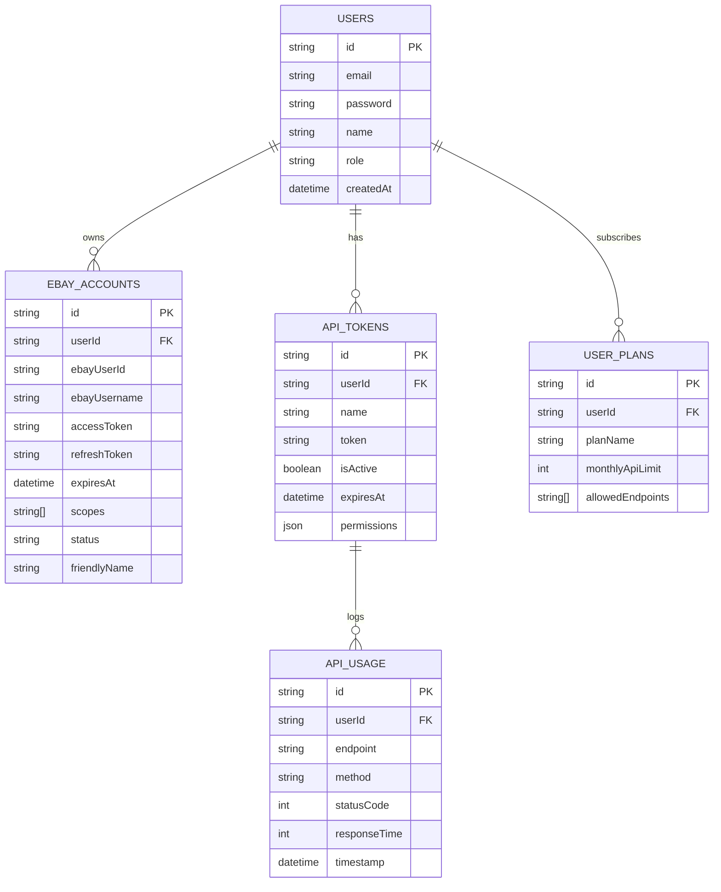

# eBay Connector

A Next.js application for managing eBay seller accounts with OAuth authentication, automatic token refresh, and a unified REST API for eBay operations.

## Features

- Multi-account eBay OAuth integration
- Automatic token refresh with expiration handling
- REST API for inventory, orders, listings, returns, and cancellations
- Both modern REST APIs and legacy Trading API (XML) support
- Dashboard for account management
- API token-based authentication for external integrations

## Tech Stack

- **Framework:** Next.js 16 with App Router & Turbopack
- **Database:** Google Firestore (Firebase Admin SDK)
- **UI:** Chakra UI v3, Emotion, Framer Motion
- **eBay SDKs:** `ebay-api`, `ebay-oauth-nodejs-client`
- **Auth:** JWT (user sessions), Bearer tokens (API)
- **Deployment:** Google Cloud Run

## Architecture

### System Overview



### Authentication Flow



### eBay OAuth Connection Flow



### Data Model



### Project Structure

```
app/
├── api/                        # API Routes
│   ├── auth/                   # User authentication
│   ├── ebay/
│   │   ├── [accountId]/        # Account-specific eBay operations
│   │   │   ├── orders/         # Fulfillment API
│   │   │   ├── inventory/      # Inventory API
│   │   │   ├── listings/       # Offer/Listing API
│   │   │   ├── returns/        # Post-Order API
│   │   │   └── trading/        # Legacy Trading API (XML)
│   │   └── oauth/              # OAuth flow
│   ├── tokens/                 # API token management
│   └── users/                  # User management
├── components/
│   ├── ebay/                   # eBay-specific components
│   ├── layout/                 # MainLayout, Sidebar
│   └── table/                  # Data tables
├── lib/
│   ├── config/                 # eBay config, endpoints
│   ├── middleware/             # Auth middleware
│   ├── services/               # Business logic
│   └── utils/                  # Helpers
└── [pages]/                    # Dashboard pages
```

## Getting Started

### Prerequisites

- Node.js 18+
- pnpm
- Google Cloud Project with Firestore enabled
- eBay Developer Account

### Environment Variables

Copy `.env.example` to `.env.local` and configure:

```bash
# Google Cloud / Firestore
GOOGLE_CLOUD_PROJECT=your-project-id
GOOGLE_APPLICATION_CREDENTIALS=./service-account.json

# eBay API
EBAY_CLIENT_ID=your-client-id
EBAY_CLIENT_SECRET=your-client-secret
EBAY_REDIRECT_URI=http://localhost:3000/api/ebay/callback
EBAY_SANDBOX=true  # false for production

# Auth
JWT_SECRET=your-jwt-secret-min-32-chars
```

### Installation

```bash
pnpm install
pnpm dev
```

Open [http://localhost:3000](http://localhost:3000).

## API Usage

All eBay API endpoints require a Bearer token and follow this pattern:

```
GET /api/ebay/{accountId}/orders
Authorization: Bearer your-api-token
```

### Example: Get Orders

```bash
curl -X GET "http://localhost:3000/api/ebay/abc123/orders" \
  -H "Authorization: Bearer your-api-token"
```

### Example: Ship an Order

```bash
curl -X POST "http://localhost:3000/api/ebay/abc123/orders/order-id/ship" \
  -H "Authorization: Bearer your-api-token" \
  -H "Content-Type: application/json" \
  -d '{
    "trackingNumber": "1234567890",
    "carrierCode": "DHL"
  }'
```

## Testing

### Strategy

| Test Type | Tool | Purpose |
|-----------|------|---------|
| Unit | Vitest | Services, utilities, middleware |
| Integration | Vitest + Firebase Emulator | API routes with Firestore |
| E2E | Playwright | OAuth flow, dashboard |

### Commands

```bash
pnpm test              # Unit tests
pnpm test:integration  # Integration tests (requires Firebase Emulator)
pnpm test:e2e          # E2E tests
```

## Deployment

Target: **Google Cloud Run**

```bash
# Build container
docker build -t ebay-connector .

# Deploy to Cloud Run
gcloud run deploy ebay-connector \
  --image gcr.io/PROJECT_ID/ebay-connector \
  --platform managed \
  --region europe-west1
```

## License

Private - Internal use only.
